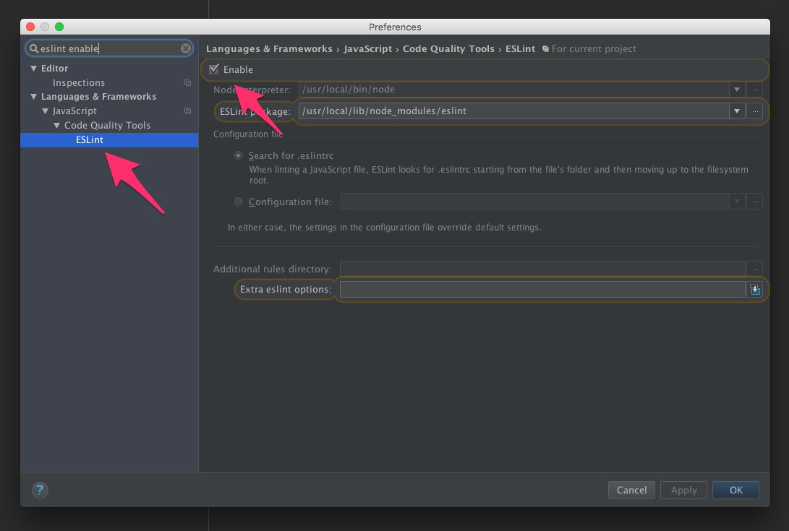



## Introduction

This style guide serves as a way to standardize JavaScript code we write at Punch Through Design.

If you can't find an answer in here, use your best judgement and keep things readable. Strive for terse, readable code.

## Use the Standard Style

> One style to rule them all. No decisions to make. It just works.

Use the [Javascript Standard Style](http://standardjs.com/).

Wondering what Standard looks like? [Here's an example file written with Standard.](https://github.com/feross/bittorrent-dht/blob/master/client.js)

### tl;dr

Here's a quick overview of the rules:

- **2 spaces** – for indentation
- **Single quotes for strings** – except to avoid escaping
- **No unused variables**
- **No semicolons**
- **Never start a line with `(` or `[`**
- **Space after keywords**
  - `if (condition) { ... }`
- **Space after function name**
  - `function name (arg) { ... }`
- Always use `===` instead of `==` – but `obj == null` is allowed to check `null || undefined`.
- Always handle the node.js `err` function parameter
- Always prefix browser globals with `window` – except `document` and `navigator` are okay

### Why Standard?

From the Standard homepage:

> The whole point of standard is to avoid bikeshedding about style. There are lots of debates online about tabs vs. spaces, etc. that will never be resolved. These debates just distract from getting stuff done. At the end of the day you have to 'just pick something', and that's the whole philosophy of standard -- its a bunch of sensible 'just pick something' opinions. Hopefully, users see the value in that over defending their own opinions.

## Usage

Use ESLint in your projects. Enforcing style with ESLint means that WebStorm will automatically pick up on your style settings and yell at you when you make mistakes.

If you install Sublime Linter, you can get the same experience in Sublime too.

### Install ESLint and plugins

```sh
npm install -g eslint eslint-config-standard eslint-plugin-standard
```

### Add an ESLint config file

Put the following into a file named `.eslintrc` into the root of each of your JS projects:

```json
{
  "extends": "standard"
}
```

### Lint Files

In your project directory:

```sh
eslint my-file.js some-src-dir
```

### Enable in Your Favorite Editor

#### Webstorm

Enable ESLint in Webstorm Preferences:

**Preferences > Languages & Frameworks > JavaScript > Code Quality Tools > ESLint**



By default, WebStorm will complain about missing semicolons at the end of a line. To turn that off, go to WebStorm Preferences:

**Preferences > Editor > Inspections > JavaScript**


Or highlight a missing semicolon error, press **Option+Return** to bring up the Quick Fix menu, and disable the inspection there:


#### Sublime Text

[Install Sublime Linter.](http://www.sublimelinter.com/en/latest/installation.html)

[Then install the ESLint plugin for Sublime Linter.](https://github.com/roadhump/SublimeLinter-eslint)
